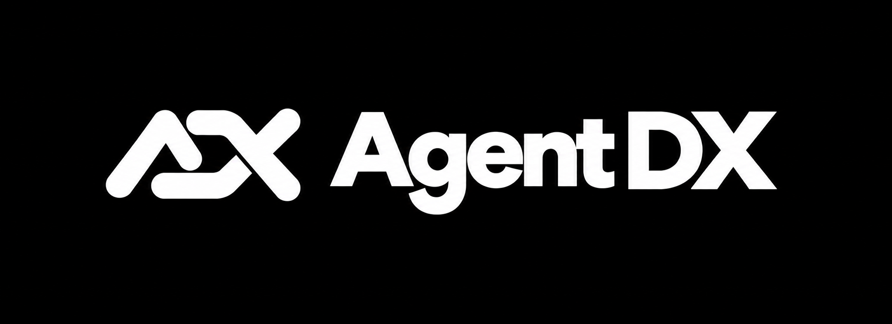
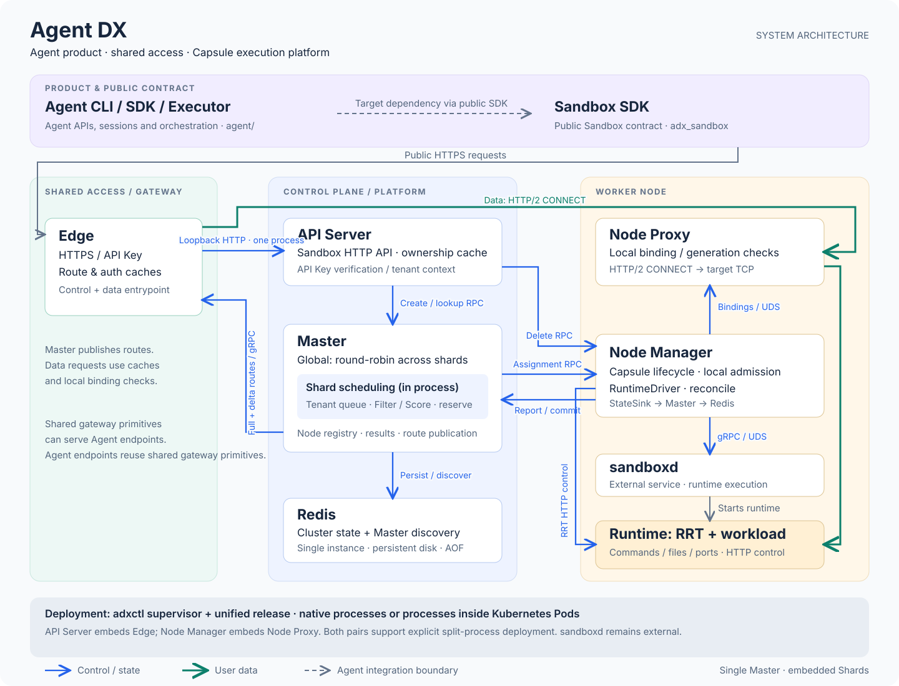

<p align="center">
  
</p>

<h3 align="center">Distributed execution substrate for openJiuwen Agent Runtime</h3>

<p align="center"><strong>English</strong> | <a href="README.zh.md">中文</a></p>

Agent DX (**Agent Distributed eXecutor**) is a distributed execution substrate for openJiuwen Agent Runtime. Its Agent layer provides Template and Environment management, with stateless Activators starting user Harnesses on demand for HTTP, WebSocket, and SSH access. It also provides a public Sandbox API and SDK, distributed scheduling, isolated execution, traffic routing, runtime operations, checkpoint recovery, and deployment tooling, while keeping the execution backend replaceable.

<p align="center">
  <a href="#-quick-start">🚀 Quick start</a> ·
  <a href="docs/architecture/repository-layout.md">📐 Architecture</a> ·
  <a href="platform/sdk/sandbox/python/README.md">📦 Sandbox SDK</a> ·
  <a href="docs/deployment/adxctl.md">⚙️ Deployment</a> ·
  <a href="docs/deployment/adxadmin.md">🔐 Administration</a> ·
  <a href="docs/testing/control-plane-ci.md">✅ Test gates</a>
</p>

## 🎯 When to use Agent DX

| Your goal | Deployment path | What you need |
|---|---|---|
| Add isolated command, file, terminal, and port operations to one agent service | Standalone | One Linux host, separately managed sandboxd, an ADX release package, and Environment networking |
| Share execution capacity across agent services and machines | Split-host roles | Persistent Redis, one Coordinator deployment, one or more worker deployments, and a reachable Gateway |
| Run a production-style cluster with repeatable acceptance | Kubernetes | Linux workers, persistent Redis, component certificates, sandboxd on worker nodes, and the ADX Kubernetes E2E profile |
| Pause, resume, clone, or recover long-running work | Standalone or distributed | A checkpoint-capable runtime plus local or S3-compatible checkpoint storage |
| Schedule accelerator workloads | Distributed | GPU/NPU inventory from workers and matching device requests in the Sandbox specification |

## 🧩 How Agent DX fits your stack

| Layer | Owns | Agent DX relationship |
|---|---|---|
| Agent framework or application | Prompts, tools, sessions, task logic, and business policy | Calls the public Sandbox SDK or HTTP API; it does not enter platform scheduling or lifecycle state machines |
| Agent DX | Authentication, placement, Environment state, routing, recovery, and observability | Provides one distributed execution contract across nodes and execution backends |
| sandboxd | Runtime creation, isolation, networking, and checkpoint primitives | Runs as an external service on each worker and is accessed through the adxlet runtime driver |
| Execd inside the Runtime | Commands, files, terminals, ports, activity, and runtime recovery cooperation | Receives data traffic through Ingress and Relay after ownership and generation checks |
| Redis and object storage | Authoritative cluster metadata and optional shared checkpoint bytes | Redis stores control state and discovery; object storage enables cross-node checkpoint access |

## 🔄 How it works



| Step | What happens | Where it lives |
|---|---|---|
| 1 · Access | A caller authenticates and creates or operates a Sandbox through one public contract. | `gateway/apiserver/`, `platform/sdk/sandbox/python/` |
| 2 · Place | API Server uses local-first admission or sends the request to Coordinator. Coordinator rotates across Shards; each Shard queues, filters, scores, and reserves a node. | `platform/coordinator/`, `platform/crates/scheduling/` |
| 3 · Run | adxlet performs final local admission, serializes the Environment lifecycle, and asks sandboxd to create a Runtime with Execd. | `platform/adxlet/`, `third_party/sandboxd/`, `platform/runtime/execd/` |
| 4 · Operate and recover | Ingress routes data to the owning Relay. Versioned ownership fences old Runtimes; pause, resume, snapshots, restart policy, and reconciliation converge state after failures. | `gateway/`, `platform/adxlet/`, Redis, checkpoint storage |

API Server embeds Ingress by default, and adxlet embeds Relay by default. Both pairs keep the same contracts when configured as separate processes.

## 📦 Installation

ADX release packages target Linux and contain `adx-coordinator`, `adxlet` (embedded Relay by default), `adx-apiserver` (embedded Ingress by default), the optional standalone `adx-ingress` and `adx-relay` binaries, `adxctl`, the read-only [`adx-inspect`](docs/deployment/adx-inspect.md), Execd, the Python Sandbox SDK, and managed Redis with `redis-cli`. The debug forwarder is a source-build tool. sandboxd remains independently managed and is pinned by [`third_party/sandboxd/source.json`](third_party/sandboxd/source.json).

```sh
mkdir adx-release
tar -xzf adx-release.tar.gz -C adx-release
sudo ./adx-release/install.sh
```

The installer verifies the manifest, file digests, and host architecture. It installs the release under `/opt/adx/releases/<commit>`, atomically switches `/opt/adx/current`, preserves `/opt/adx/config`, `/opt/adx/data`, and `/opt/adx/run` across upgrades, and exposes `adxctl` through `/usr/local/bin`.

## 🔧 Quick start

The default `standalone` profile starts managed Redis, Coordinator, adxlet with embedded Relay, and API Server with embedded Ingress on one host. Prepare sandboxd, networking, certificates, and the initial administrator key first.

```sh
sudo adxctl config init --profile standalone
sudoedit /opt/adx/config/deployment.yaml
sudo adxctl validate
sudo adxctl run
```

Install the platform-independent administrator wheel on an operator workstation,
then create the first tenant Key through the public HTTPS API:

```sh
pipx install ./adxadmin-0.1.0-py3-none-any.whl
export ADX_ENDPOINT=https://adx.example.com:8443
export ADX_CA_FILE=$HOME/.config/adx/public-ca.pem
export ADX_ADMIN_TOKEN_FILE=$HOME/.config/adx/admin.key
adxadmin key create --tenant example
```

See the [`adxadmin` guide](docs/deployment/adxadmin.md) for listing, pagination,
revocation, JSON output, and the error contract.

In another terminal, install the packaged SDK and point it at the public Gateway:

```sh
python3 -m venv /opt/adx-client
/opt/adx-client/bin/python -m pip install /opt/adx/current/sdk/adx_sandbox-*.whl

export ADX_SERVER_ADDRESS=adx.example.com:8443
export ADX_GATEWAY_ADDRESS=adx.example.com:8443
export ADX_TOKEN="$(cat /secure/path/tenant-api-key)"
export ADX_TLS=1
export ADX_GATEWAY_TLS=1
export ADX_SANDBOX_IMAGE=python:3.12-slim
```

Create a Sandbox, execute through Execd, and delete it explicitly:

```python
import os
from adx_sandbox import Sandbox

sandbox = Sandbox(
    image=os.environ["ADX_SANDBOX_IMAGE"],
    cpu=1000,
    memory=2048,
    name="readme-demo",
)
try:
    result = sandbox.commands.run("printf 'hello from ADX\\n'")
    print(result.stdout)
finally:
    sandbox.kill()
```

The image must be supported by the configured sandboxd and [ADX Runtime Environment](docs/deployment/runtime-environment.md). See the [Sandbox SDK guide](platform/sdk/sandbox/python/README.md) for pause/resume, reusable snapshots, placement, mounts, network configuration, data-plane security, and retry semantics.

## 🏗️ Deployment options

| Topology | `adxctl` profile | Processes on this host |
|---|---|---|
| Standalone with managed Redis | `standalone` | Redis, Coordinator, adxlet + Relay, API Server + Ingress |
| Standalone with external Redis | `standalone-external-redis` | Coordinator, adxlet + Relay, API Server + Ingress |
| Control host | `coordinator` | Coordinator; Redis may be managed separately or added to the full YAML |
| Worker host | `node` | adxlet + Relay by default |
| Ingress host | `ingress-api` | API Server + Ingress by default |

Every host has its own `/opt/adx/config/deployment.yaml`. Cluster members share the Redis URL, namespace, and mTLS trust. Every worker has a unique `node_id` and reachable control and proxy addresses. Start Redis → Coordinator → workers → API Server. Set `proxy_mode: standalone` or `ingress_mode: standalone` only when those components need separate processes.

YAML string values support `${VAR}` and `${VAR:-default}`. Use `adxctl config dump` to inspect the fully resolved profile and host overrides. Complete fields and certificates are documented in the [`adxctl` reference](docs/deployment/adxctl.md), [standalone guide](docs/deployment/standalone.md), and [configuration examples](build/config/examples/README.md).

## 📐 Core abstractions

ADX separates stable logical identity from replaceable execution:

| Abstraction | Meaning and boundary |
|---|---|
| Agent `Environment` | Agent execution context bound 1:1 to a stable logical Sandbox; managed through stateless Activators |
| `Sandbox` | Public API and SDK handle presented to applications |
| Platform `Environment` | Stable internal identity containing tenant, specification, lifecycle, and desired/observed state |
| `RuntimeProfile` | Deployment-owned rootfs, bootstrap and startup variables; configuration rather than a running Environment |
| `Runtime` | One concrete sandboxd execution of an Environment on one node; restart or recovery may replace it |
| `Assignment` | Authoritative node and device ownership with a `generation` that fences late old execution |
| `Route` / `Binding` | Versioned ownership published to Ingress and rechecked locally by Relay before forwarding |
| `Restore Point` / `Snapshot` | A restore point keeps the Environment ID; a reusable Snapshot creates a new Environment |
| `Request ID` / `Operation ID` | One logical write identity for retry, deduplication, result lookup, and reconciliation |

The fixed control path is Agent/application → Sandbox SDK/HTTP API → API Server → Coordinator/Shard scheduler or local-first adxlet → sandboxd. Runtime traffic follows Ingress → Relay → Execd and does not enter lifecycle queues. Compatibility fields such as `instanceId`, `instance_id`, and `/api/instances` are translated at the public boundary; internal Rust types, RPCs, persistence keys, metrics, and runtime identity use Environment terminology.

[Component names and abstractions](docs/architecture/naming.md).

## ✨ Capabilities

- Environment creation, query, deletion, pause, resume, reusable snapshots, and snapshot-based cloning.
- Central and local-first creation with CPU, memory, disk, GPU/NPU device, label, affinity, and preference constraints.
- API Key administrator and tenant identities plus configurable internal mTLS.
- Versioned route publication and synchronized local binding checks.
- Node reconciliation, restart policy, idle deletion, checkpoint recovery, local/S3-compatible storage, and reference-aware artifact cleanup.
- Prometheus metrics, OpenTelemetry traces, structured component logs, and external Collector integration. Node runtime stdout/stderr is redirected to per-runtime files with terminated-log compression and GC.
- Process deployment with managed or external Redis and Kubernetes end-to-end deployment profiles.

## 🛠️ Development and test

The root Cargo workspace contains the platform and Agent components. Python packages build independently. Build outputs belong under `out/` or a configured external cache.

```sh
make help
make rust-check
cargo test --locked --workspace --all-features -j 2
make agent-test
PYTHONPATH=platform/sdk/sandbox/python \
  python -m pytest -q -c platform/sdk/sandbox/pytest.ini \
  platform/sdk/sandbox/python/tests
make package PYTHON=/path/to/venv/bin/python
```

Run component and integration suites with `python3 build/ci/run.py <suite>`. End-to-end gates use installed release artifacts, the public Sandbox SDK, Redis, Gateway, the control plane, sandboxd, and Execd. Environment requirements and gate definitions are in [control-plane CI](docs/testing/control-plane-ci.md) and the [Kubernetes E2E guide](build/e2e/kubernetes/README.md).

Buildkite uses independent `agent-dx` (including SDK, adxadmin and K8s L0), `agent-dx-python-sdk`, `agent-dx-admin`,
and `agent-dx-full-test` pipelines. The SDK and admin pipelines always build and
check their wheel/sdist; each PyPI upload is an independent explicit,
tag-gated option. The Full pipeline
consumes explicit base-package and SDK build UUIDs and does not rebuild either candidate. See the
[Buildkite pipeline contract](.buildkite/README.md).

The SDK distribution is `adx-sandbox`, its Python import is `adx_sandbox`, and its CLI is `adx-sandbox`. ADX environment variables use the `ADX_` prefix, and internal branded HTTP headers use `X-ADX-`.

## 📚 Learn more

- [Architecture and repository layout](docs/architecture/repository-layout.md)
- [Agent usage](agent/README.md)
- [Sandbox API](gateway/apiserver/docs/sandbox-lifecycle-api.md) and [OpenAPI](platform/api/openapi/sandbox.yaml)
- [Data-plane OpenAPI](platform/api/openapi/data-plane.yaml)
- [Sandbox Python SDK](platform/sdk/sandbox/python/README.md)
- [Deployment configuration](docs/deployment/adxctl.md) and [examples](build/config/examples/README.md)
- [Remote cluster administration](docs/deployment/adxadmin.md) and [API Key management](docs/testing/api-key-management.md)
- [Scheduling](docs/testing/scheduling-performance.md), [node lifecycle](docs/testing/node-lifecycle.md), and [route publication](docs/testing/route-publication.md)
- [Checkpoint and snapshot storage](docs/testing/snapshot-storage.md)
- [Runtime stdout/stderr and retention](docs/testing/runtime-logs.md)
- [Metrics](docs/testing/environment-resource-metrics.md), [logs](docs/testing/log-collection.md), and [distributed tracing](docs/testing/distributed-traces.md)
- [Rust coding guidelines](docs/development/rust-coding-guidelines.md)
- [Release pipelines and package layout](docs/development/release-pipelines-and-packaging.md)
- [Brand and architecture assets](assets/README.md)

## License

Agent DX is released under the [Apache License 2.0](LICENSE).
