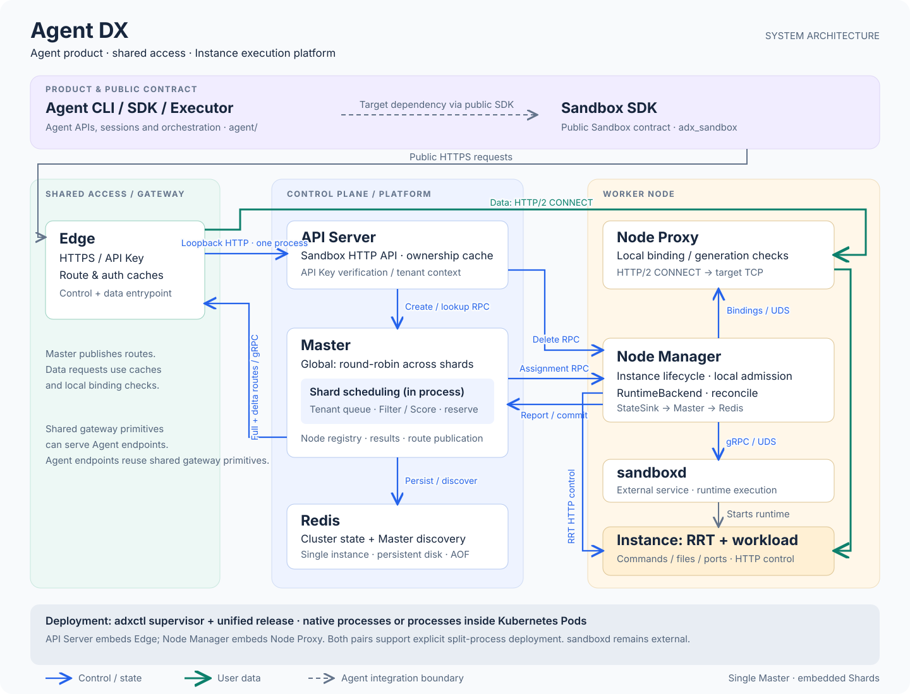

**English** | [中文](README.zh.md)

# Agent DX

Agent DX is an execution platform for agents and isolated Instances. It provides a public Sandbox API and SDK, distributed scheduling, node-local lifecycle management, shared traffic entrypoints, runtime operations, checkpoint recovery, and deployment tooling in one repository.



## Architecture

Agent applications use the public Sandbox SDK to create and operate Instances. Gateway terminates external traffic and separates control requests from data requests. API Server authenticates callers and serves the Sandbox HTTP API. Master owns cluster state, scheduling, node health, route publication, credentials, and snapshot metadata. Node Manager performs final local admission and serializes the lifecycle of every Instance. Node Proxy forwards data traffic to RRT inside the selected Instance.

Redis is the authoritative cluster store and discovery backend. Node Manager uses a local SQLite journal only when cluster-state submission is temporarily unavailable. sandboxd is managed by the deployment environment and provides the execution backend. API Server embeds Edge by default, and Node Manager embeds Node Proxy by default; both pairs retain an explicit split-process deployment.

## Core abstractions

ADX uses **Instance** as the internal managed execution unit. **Sandbox** is the public API and SDK facade. Agent Distributed Executor sits above the platform and consumes Instance capabilities through the Sandbox SDK; it does not participate in platform scheduling or lifecycle state machines.

| Abstraction | Layer | Meaning and boundary |
|---|---|---|
| `Agent` / `Session` | Agent | Agent tasks, sessions, affinity, and execution orchestration; accesses the platform only through the public Sandbox SDK |
| `Sandbox` | Public API | The user's API/SDK handle; one creation maps to one Instance and is not an internal scheduling object |
| `Instance` | Control plane | Stable internal identity with tenant, specification, and desired/observed state; create, pause, resume, and delete converge around it |
| `Assignment` | Scheduler | Authoritative Instance ownership, including node, devices, and `generation`; a newer generation fences late execution from an older owner |
| `Shard` | Master scheduler | An in-process scheduling partition. Global selection rotates across Shards; each Shard owns queueing, Filter/Score, and node selection |
| `Node` | Node layer | One Node Manager registration session with capacity, devices, and health; Node Manager performs final local admission |
| `Runtime Environment` | Execution | How RRT, the bootstrap command, and local EROFS/OCI runtime content enter an Instance; sandboxd is the current execution backend |
| `Route` / `Binding` | Data plane | Master publishes versioned Instance ownership, Edge caches it, and Node Proxy rechecks the local binding before forwarding |
| `Restore Point` / `Snapshot` | Recovery | A pause restore point retains the Instance ID; a reusable Snapshot creates a new Instance and stores bytes locally or in object storage |
| `Request ID` / `Operation ID` | Reliability | Identifies one logical write for retry, deduplication, result lookup, and reconciliation; a timeout does not automatically mean failure |

The fixed layering is: Agent/application → Sandbox SDK/HTTP API → API Server → Master/ShardScheduler or local-first Node Manager → sandboxd. Runtime traffic follows Edge → Node Proxy → RRT inside the Instance and does not enter control-plane lifecycle queues.

| Directory | Responsibility |
|---|---|
| `agent/` | Agent APIs, sessions, dispatch, and execution orchestration |
| `crates/` | Product-wide error semantics, observability, process bootstrap, and transport support |
| `gateway/` | Public Sandbox API Server, Edge entrypoint, Node Proxy, routing, and forwarding |
| `gateway/api-server/` | Sandbox HTTP API, authentication, ownership cache, and Instance RPC clients; embeds Edge by default |
| `platform/master/` | Cluster state, scheduling shards, Redis persistence, routes, credentials, and snapshots |
| `platform/node-manager/` | Local admission, Instance lifecycle, sandboxd integration, checkpoints, and outage journal |
| `platform/runtime/rrt/` | Instance-local command, file, terminal, activity, and recovery operations |
| `platform/sdk/sandbox/python/` | Public Python Sandbox SDK |
| `platform/api/proto/` | Internal Instance, node, route, credential, and snapshot contracts |
| `platform/deployment/` | `adxctl`, configuration rendering, process supervision, and shutdown cleanup |
| `build/` and `.buildkite/` | Build, packaging, release, and end-to-end validation tooling |

## Capabilities

- Instance creation, query, deletion, pause, resume, snapshots, and snapshot-based cloning.
- Central and local-first creation paths with CPU, memory, disk, GPU/NPU device, label, affinity, and preference constraints.
- API Key authentication with administrator and tenant identities; internal services use configurable mTLS.
- Versioned route publication from Master to Edge and synchronized local bindings between Node Manager and Node Proxy.
- Node reconciliation, restart policies, idle deletion, checkpoint recovery, local and S3-compatible snapshot storage, and reference-aware artifact cleanup.
- Prometheus metrics, OpenTelemetry traces, structured logs, log rotation, gzip compression, and external Collector integration.
- Process deployment with managed or external Redis, plus Kubernetes end-to-end deployment profiles.

## Deployment

The same ADX release package can start different roles by configuration. The deployment environment must provide a Linux host, separately managed sandboxd, component certificates, an initial administrator API Key, Instance networking, and an architecture-matching release installed at `/opt/adx`. `adxctl` reads one YAML file describing the **current host**, by default `/etc/adx/deployment.yaml`. It validates, renders, and supervises processes; it does not create Instances.

### Standalone with ADX-managed Redis

The default `standalone` profile starts Redis, Master, Node Manager with embedded Node Proxy, and API Server with embedded Edge on one host. sandboxd remains independently managed by the deployment environment.

```sh
sudo install -d -m 0700 /etc/adx /etc/adx/tls /etc/adx/secrets /var/lib/adx /run/adx
sudo /opt/adx/bin/adxctl config init --profile standalone

# Edit certificates, the bootstrap key, sandboxd socket, Instance CIDR, and disk paths.
sudo /opt/adx/bin/adxctl validate
sudo /opt/adx/bin/adxctl render --output /run/adx/config-review
sudo /opt/adx/bin/adxctl run
```

`run` keeps the supervisor in the foreground; production deployments should let systemd or the Pod supervise it. In another terminal, inspect or stop the host deployment:

```sh
sudo /opt/adx/bin/adxctl status
sudo /opt/adx/bin/adxctl stop
```

### Standalone with external Redis

```sh
sudo /opt/adx/bin/adxctl config init --profile standalone-external-redis
sudoedit /etc/adx/deployment.yaml   # Set the real redis_url and namespace.
sudo /opt/adx/bin/adxctl validate
sudo /opt/adx/bin/adxctl run
```

External Redis is outside `adxctl status`, restart budgets, and `stop`. Every component must use the same persistent Redis and namespace.

### Split-host roles

Generate an independent configuration on the control host, every worker, and the ingress host. Do not list multiple nodes in one host YAML:

```sh
# Control host: Master. Add a redis role to the full YAML if this host manages Redis.
sudo /opt/adx/bin/adxctl config init --profile master

# Every worker: Node Manager with embedded Node Proxy by default.
sudo /opt/adx/bin/adxctl config init --profile node

# Ingress host: API Server with embedded Edge by default.
sudo /opt/adx/bin/adxctl config init --profile edge-api
```

Edit `/etc/adx/deployment.yaml` on each host. All files use the same `redis_url`, `namespace`, and matching mTLS trust; each worker needs a unique `node_id` and reachable control and proxy addresses. Start Redis → Master → workers → API Server (including Edge). Node Proxy and Edge become separate processes only when `proxy_mode: standalone` or `edge_mode: standalone` is selected explicitly.

YAML string values support `${VAR}` and `${VAR:-default}`. Use `adxctl config dump` to inspect the fully merged profile, environment, and host overrides. Kubernetes runs the same processes in Pods while the deployment environment provides `adxctl run`, certificates, Redis connectivity, and sandboxd.

See the [`adxctl` reference](docs/deployment/adxctl.md), [standalone guide](docs/deployment/standalone.md), [configuration examples](build/config/examples/README.md), and [runtime environment guide](docs/deployment/runtime-environment.md) for complete fields, certificates, Redis, networking, and runtime setup.

## Usage

The release package contains the `adx-sandbox` wheel under `sdk/`. After the deployment is ready, install it and configure the external entrypoint and API Key:

```sh
python3 -m venv /opt/adx-client
/opt/adx-client/bin/python -m pip install /opt/adx/sdk/adx_sandbox-*.whl

export ADX_SERVER_ADDRESS=adx.example.com:8443
export ADX_GATEWAY_ADDRESS=adx.example.com:8443
export ADX_TOKEN="$(cat /secure/path/tenant-api-key)"
export ADX_TLS=1
export ADX_GATEWAY_TLS=1
export ADX_SANDBOX_IMAGE=python:3.12-slim
```

Create an Instance, execute through RRT, and delete it explicitly:

```python
import os
from adx_sandbox import Sandbox

sandbox = Sandbox(
    image=os.environ["ADX_SANDBOX_IMAGE"],
    cpu=1000,
    memory=2048,
    name="readme-demo",
)
try:
    result = sandbox.commands.run("printf 'hello from ADX\\n'")
    print(result.stdout)
finally:
    sandbox.kill()
```

The image must be supported by the configured sandboxd and ADX Runtime Environment. Applications that avoid process-global environment variables can construct `ConnectionConfig` explicitly. See the [Sandbox Python SDK](platform/sdk/sandbox/python/README.md) for pause/resume, reusable snapshots, placement, and retry semantics, and the [Sandbox API](gateway/api-server/docs/sandbox-lifecycle-api.md) for raw HTTP paths and payloads. Agent applications start from the [Agent guide](agent/README.md) and use the same Sandbox SDK underneath.

## Build and test

The root Cargo workspace contains the platform and Agent components. Python packages build independently. Build outputs belong under `out/` or a configured external cache.

```sh
make help
make rust-check

cargo test --locked --workspace --all-features -j 2
make agent-test
PYTHONPATH=platform/sdk/sandbox/python \
  python -m pytest -q -c platform/sdk/sandbox/pytest.ini \
  platform/sdk/sandbox/python/tests

make package PYTHON=/path/to/venv/bin/python
```

Run component and integration suites with `python3 build/ci/run.py <suite>`. End-to-end gates use installed release artifacts, the public Sandbox SDK, Redis, Gateway, the control plane, sandboxd, and RRT. Environment requirements and gate definitions are documented in [control-plane CI](docs/testing/control-plane-ci.md) and the [Kubernetes E2E guide](build/e2e/kubernetes/README.md).

The Sandbox SDK distribution is `adx-sandbox`, its Python import is `adx_sandbox`, and its CLI is `adx-sandbox`. ADX environment variables use the `ADX_` prefix, and internal branded HTTP headers use `X-ADX-`.

## Documentation

- [Architecture and repository layout](docs/architecture/repository-layout.md)
- [Agent usage](agent/README.md)
- [Sandbox API](gateway/api-server/docs/sandbox-lifecycle-api.md)
- [Sandbox OpenAPI](platform/api/openapi/sandbox.yaml)
- [Data-plane OpenAPI](platform/api/openapi/data-plane.yaml)
- [Sandbox Python SDK](platform/sdk/sandbox/python/README.md)
- [Deployment configuration examples](build/config/examples/README.md)
- [Node lifecycle and resource collection](docs/testing/node-lifecycle.md)
- [Checkpoint and snapshot storage](docs/testing/snapshot-storage.md)
- [Scheduling](docs/testing/scheduling-performance.md)
- [Route publication](docs/testing/route-publication.md)
- [Metrics](docs/testing/instance-resource-metrics.md)
- [Logs](docs/testing/log-collection.md)
- [Distributed tracing](docs/testing/distributed-traces.md)
- [Rust coding guidelines](docs/development/rust-coding-guidelines.md)
- [Release pipelines and package layout](docs/development/release-pipelines-and-packaging.md)
