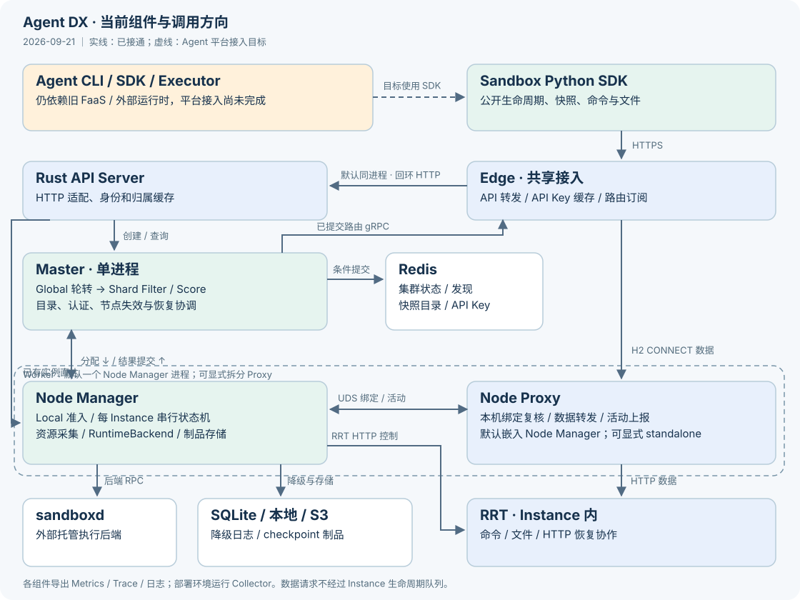

# Agent DX

Monorepo for Agent Distributed Executor, the Instance execution platform, and shared gateways.

| Directory | Responsibility |
|---|---|
| `agent/cli` | Python `adx` CLI |
| `agent/sdk/python` | Agent programming SDK |
| `agent/executor` | In-instance Agent Executor |
| `agent/tests` | Existing Agent unit/integration tests and shared fixtures |
| `gateway` | Rust Edge, Node Proxy, and forwarder |
| `platform/runtime/rrt` | RRT daemon and runtime adapter |
| `platform/sdk/sandbox/python` | Public Sandbox SDK |
| `platform/control-plane/master` | Rust Master, Shard scheduling, Redis and route/snapshot catalogs |
| `platform/control-plane/node-manager` | Instance lifecycle, sandboxd, checkpoints and outage journal |
| `platform/control-plane/control-cli` | Rust adxctl and process supervisor |
| `platform/control-plane/api-server` | Rust public HTTP API, authentication, ownership cache and direct Instance RPC |
| `platform/api/proto` | Instance, snapshot, credentials, routes and node-local protocol definitions |

The Agent product targets the public Sandbox SDK; its current CLI/SDK/Executor still require the legacy Agent backend. The new platform package alone does not run that Agent business flow. The Rust API Server rewrite has passed [Kubernetes acceptance](docs/testing/2026-09-17-rust-api-server-k8s.md); see [migration steps](docs/testing/rust-api-server.md). Rust Master and Node Manager expose authenticated service processes, Redis persistence/discovery, scheduling and node lifecycle recovery; the Rust API Server connects to those services. Edge subscribes to committed routes over gRPC, while Node Proxy requires a complete local binding synchronization before admission. See [implementation status](docs/testing/control-plane-implementation.md) and [route publication](docs/testing/route-publication.md). The Rust process supervisor and unified package are implemented; see [process deployment](docs/testing/process-deployment.md). Local public-SDK acceptance now covers real Firecracker pause/resume, S3 recovery and node lifecycle failures. See the [stage roadmap](docs/testing/control-plane-roadmap.md) for completed gates and remaining work.



See [current layout](docs/architecture/repository-layout.md) and [public API support](platform/control-plane/api-server/docs/sandbox-lifecycle-api.md). Client options such as network policy, entrypoint inheritance and reload are not all supported by the new backend.

## Build and test

Local component and Socket checks use `python3 build/ci/run.py <suite>`. Buildkite has separate release, image and Kubernetes public-SDK steps. [Buildkite #30](docs/testing/2026-09-18-runtime-environment-k8s.md) passed all eight basic K8s groups, including local-first creation, node failure, restart, resource metrics, logs and traces. Its Kubernetes profile uses the immutable OCI runtime image; standalone deployment retains the local EROFS path. Checkpoint/snapshot/cross-node recovery use local Firecracker acceptance; the K8s FC profile is deferred. See [local checks and end-to-end acceptance](docs/testing/control-plane-ci.md) for prerequisites and implementation milestones.

Rust uses the root Cargo workspace. The Sandbox SDK uses distribution `adx-sandbox`, import `adx_sandbox`, CLI `adx-sandbox`, and `ADX_*` environment settings. Agent namespaces are `adx.agentruntime` and `adx.agentexecutor`; Gateway binaries use `adx-`, configuration uses `ADX_`, and internal branded headers use `X-ADX-`. Run matching component versions together.

```sh
cargo test --locked --workspace --all-features -j 2
python -m pytest -q
PYTHONPATH=platform/sdk/sandbox/python python -m pytest -q -c platform/sdk/sandbox/pytest.ini platform/sdk/sandbox/python/tests

cargo test --locked -p adx-api-server -j 2
```

`make help` lists the combined entrypoints. Install Python test/build requirements in a virtual environment (`pytest`, `pytest-asyncio`, `setuptools`, `wheel`, `build`, and each package's dependencies). `make package PYTHON=/path/to/venv/bin/python` produces the four Python distributions under `out/wheels`. `BUILD_VERSION` can set release versions explicitly. The Sandbox SDK has its own `VERSION`; it does not derive its version from Agent repository tags.

Set `CARGO_TARGET_DIR` to a persistent cache in automation. Building the external sandboxd dependency additionally uses Go caches. `build/` contains source scripts; temporary build outputs belong in `out/` or a cache directory. `bash build.sh -C` cleans package artifacts and preserves the source scripts.

The Rust API Server has an `adx-api-server` process entrypoint and configuration under `build/config/examples/`. Component integration evidence is separate from complete platform deployment validation.

See [migration status](docs/migration/2026-09-14-import.md), [source pins](docs/migration/sources.json), [architecture](docs/architecture/repository-layout.md), and [Agent usage](agent/README.md).


## Instance lifecycle and deployment

- [Single-host installation, certificates and CLI](docs/deployment/standalone.md)
- [EROFS/OCI runtime environment and custom-image bootstrap](docs/deployment/runtime-environment.md)
- [CLI and unified process deployment](docs/testing/process-deployment.md)
- [Node lifecycle, resource collection and SQLite outage contract](docs/testing/node-lifecycle.md)
- [Checkpoint storage, S3 and snapshot catalog](docs/testing/snapshot-storage.md)
- [Node Manager / Node Proxy process modes](docs/testing/node-proxy-process-modes.md)
- [Current scheduling baseline recheck](docs/testing/2026-09-16-scheduling-recheck.md)
- [Instance inventory and resource metrics](docs/testing/instance-resource-metrics.md)
- [Component log rotation and compression](docs/testing/log-rotation.md)
- [Live development progress](docs/testing/live-progress.md)

Reusable snapshot creation, cloning into new Instances, catalog queries and deferred artifact deletion are wired through the control plane. The recorded package-v16 Firecracker/MinIO run passed 17 scenarios, including independent clone identities, process memory, writable files and retired-session orphan cleanup after authoritative recovery. Later package-v17 runs exposed an intermittent dual-clone network failure; see the [investigation](docs/testing/2026-09-16-fc-clone-network.md). Local FC cross-node recovery and returning-node cleanup have passed. Remaining current gates are the dual-clone network issue, physical GPU/NPU validation and full-service mixed-load/soak acceptance. Full stage completion is tracked separately from passing component tests or local runtime scenarios.

租户凭证的创建、查询、吊销及缓存契约见 [API Key 管理](docs/testing/api-key-management.md)。

可观测： [实例与资源指标](docs/testing/instance-resource-metrics.md) · [组件日志采集](docs/testing/log-collection.md) · [跨组件Trace](docs/testing/distributed-traces.md) · [日志滚动压缩](docs/testing/log-rotation.md)。
