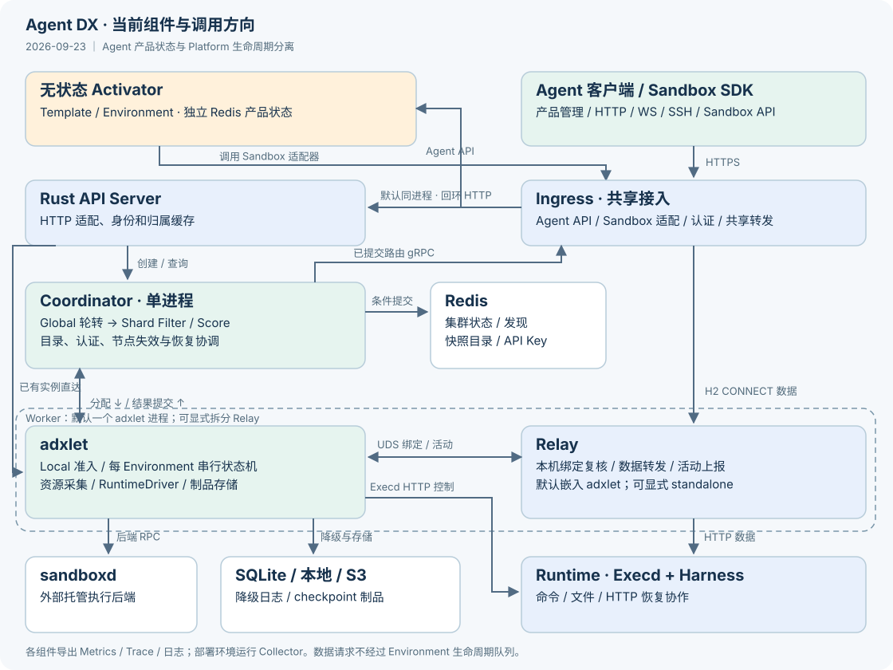

# Agent DX 当前目录与组件边界

核对日期：2026-09-23。此页描述当前源码布局；首次导入记录保留在 [迁移报告](../migration/2026-09-14-import.md)。[HTML 阅读版](repository-layout.html) 从本文件生成，架构图为仓库内 SVG。



## 分层与当前接入状态

| 层 | 职责 | 当前状态 |
|---|---|---|
| Agent 产品 `agent/` | Template、Environment、无状态 Activator、inline 适配 | Rust 产品 API 集成在 Gateway Ingress；Environment 与稳定逻辑 Sandbox 1:1 绑定，首次访问按需激活 |
| 公开能力 `platform/sdk/sandbox` | Sandbox 生命周期、命令/文件、快照、放置约束 | Python SDK 已实现；客户端保留字段与新服务端支持范围不同 |
| 执行平台 `platform/` | 通用 Environment、调度、持久化、节点生命周期、Execd | Coordinator、adxlet、本地优先创建及 EROFS/OCI 运行环境已接入；沿用已有实现；本次验证见 [命名调整记录](../testing/environment-naming.md) |
| 共享接入 `gateway/` | Sandbox API Server、Ingress、Relay、反向代理与转发 | API Server 默认内嵌 Ingress；adxlet 默认内嵌 Relay；Agent API 装配于 Ingress，业务规则归 Agent 层 |

Agent API 在 Gateway Ingress 内处理产品请求，默认通过 LocalControl 调用同进程无状态 Activator，也可配置 remote 访问独立 Activator。Activator 持久化 Template/Environment；内嵌模式直接调用本地 Sandbox trait，独立模式调用 Gateway Sandbox HTTP 接口，均由 Sandbox 适配器访问平台。Agent 不直接操作平台 Redis/SQLite 或 sandboxd。inline create/get/kill 直接调用 Sandbox 适配器。用户 Harness 的 HTTP/WS/SSH 经共享数据面转发，业务协议由用户定义。

API Server 仍保留原有九条 `/api/agent` 兼容转发路由，由 `agent_address` 指向外部 Agent 服务；这是平台侧既有入口，不属于当前 Ingress Agent API／Activator 链路，本轮保持不变。

平台内部以 **Environment + Runtime** 建模。Environment 是跨节点、暂停恢复和故障接管期间保持不变的逻辑身份，持有期望规格、生命周期、归属和 checkpoint 引用；Runtime 是 sandboxd 在某个节点创建的一次物理执行，具有独立 `runtime_id`，重启、恢复或接管时可以替换。二者通过 `RuntimeIdentity { environment_id, runtime_id, ownership_generation }` 绑定，adxlet 只允许当前 generation 的 Runtime 对外提供服务。

公开 Sandbox HTTP/SDK 契约继续使用 `/api/instances`、`instanceId` 和 `instance_id`；API Server 在边界将这些兼容字段映射为 `environment_id`。内部 Rust 类型、gRPC、持久化字段与 Metrics 统一使用 Environment/Runtime。详见 [命名与抽象](naming.md)。

## 实际目录

```text
agent-dx/
├── Cargo.toml / Cargo.lock / rust-toolchain.toml
├── Makefile / build.sh / VERSION / pytest.ini
├── assets/                       # Logo、设计语言与架构图的统一来源
│   ├── logo/                     # 黑白标志、独立图标和反相版本
│   └── architecture/             # 系统架构与当前组件调用图
├── agent/
│   ├── api/                       # Gateway 产品入口与 inline 适配
│   ├── activator/                 # 无状态产品管理与按需激活
│   └── crates/                    # core 协议模型、store 产品状态；测试随各 crate 放置
├── crates/                        # 跨 Gateway / Platform / Runtime 的横切库
│   ├── error/                     # 稳定错误码、重试与操作结果语义
│   ├── observability/             # 日志、Metrics、Trace 与进程日志捕获
│   ├── process/                   # 进程配置、退出信号和宿主资源准备
│   └── transport/                 # TLS、请求上下文和 deadline 传播
├── platform/
│   ├── coordinator/              # Rust Coordinator；Global + 内嵌 Shard
│   ├── adxlet/                   # Rust 本机生命周期和后端/存储适配
│   ├── crates/
│   │   ├── core/                  # Environment、资源、恢复点、调度纯类型
│   │   ├── protocol/              # gRPC 生成、转换与组件身份
│   │   ├── discovery/             # Redis 服务地址发现
│   │   └── scheduling/            # Filter / Score、快照与查询索引
│   ├── api/
│   │   ├── proto/environment.proto   # Coordinator / Node 管理服务
│   │   ├── proto/environment_types.proto # Environment / 资源 / 调度类型
│   │   ├── proto/snapshot.proto   # 快照目录与引用
│   │   ├── proto/credentials.proto # 认证和密钥管理
│   │   ├── proto/routes.proto     # 路由发布
│   │   ├── proto/node.proto       # Relay 绑定与活动
│   │   └── http/runtime-control.md
│   ├── runtime/execd/            # HTTP 运行时与 checkpoint 协作
│   ├── deployment/                # 统一 adxctl / supervisor；管理控制面和数据面进程
│   └── sdk/sandbox/python/        # adx-sandbox / adx_sandbox
├── gateway/
│   ├── apiserver/                # Rust HTTP、认证缓存和 Environment RPC
│   │   ├── src/                   # contract、http、clients、operations
│   │   ├── tests/                 # HTTP 契约与校验
│   │   └── docs/                  # Sandbox HTTP 支持范围
│   └── src/
│       ├── common/                # Gateway 内部监听、路由与数据面协议
│       ├── ingress/               # Agent/Sandbox 适配、路由订阅、认证、连接池、反向代理
│       ├── node/                  # RelayService、绑定、活动、转发
│       └── bin/                   # Ingress、Relay、forwarder
├── tools/
│   └── admin/                     # adxadmin Python wheel；经公开 HTTPS 管理租户 API Key
├── third_party/sandboxd/          # 锁定后端协议、来源与许可证
├── build/
│   ├── ci/ / images/              # 本地检查、镜像配方
│   ├── config/examples/           # 统一部署 YAML 和按角色示例
│   ├── release/                   # 二进制、Execd、SDK、Redis 汇总与验证
│   ├── e2e/                       # 本地 Docker 公共 SDK 验收
│   │   ├── kubernetes/            # 基础 K8s 部署、证据与清理
│   │   ├── firecracker/           # 本地 FC；可选 K8s FC 驱动
│   │   └── example/               # 安装示例验收
│   ├── observability/             # 外部 Collector / Prometheus 示例
│   ├── docs/                      # 架构页生成与文档检查
│   └── dev/                       # 自动刷新本地进度页
├── .buildkite/                    # 独立 build / images / K8s E2E 步骤
└── docs/                          # 架构、部署、契约、验收和迁移记录
```

此树只展示主要已存在路径。语言构建输出与测试证据放在 `out/` 或显式外部缓存，`build/` 保存源码脚本。运行时数据库、日志与 checkpoint 使用部署配置的数据目录。

## 控制面内部模块

| 组件 | 现有主要模块 | 职责 |
|---|---|---|
| Coordinator | `lib.rs`、`shard.rs`、`queue.rs`、`journal.rs` | Global 轮转、Shard 内存队列、预留、增量调度视图；租户间轮转，租户内优先级/FIFO |
| Coordinator | `storage.rs`、`storage/`、`rpc.rs`、`rpc/` | Redis 条件提交、原子归属、目录、节点失效、快照克隆、共享恢复协调；不执行节点普通生命周期 |
| Coordinator | `auth.rs`、`routes.rs`、`metrics.rs` | API Key 摘要、路由发布、集群指标 |
| adxlet | `controller.rs`、`controller/{lifecycle,monitor,snapshots}.rs` | 每 Environment 串行任务、暂停/恢复/删除、空闲回收与重启 |
| adxlet | `sandboxd.rs`、`runtime_control.rs`、`readiness.rs` | RuntimeDriver 适配；本地 EROFS／OCI image 环境；Execd HTTP 协作与就绪 |
| adxlet | `checkpoint.rs`、`checkpoint/` | 可扩展 CheckpointStore、本地/S3、缓存引用和远端孤儿回收 |
| adxlet | `journal.rs`、`reconciliation.rs` | SQLite 故障降级日志与 Coordinator 权威目录对账 |
| adxlet | `resources.rs`、`routes.rs`、`activity.rs`、`proxy.rs` | 容量源/准入、绑定同步、活动采集、代理进程组合 |
| Rust API Server | `contract.rs`、`http.rs`、`clients.rs`、`operations.rs` | HTTP 兼容字段到 Environment RPC；认证、版本化 Environment 目录订阅、入口节点轮转、直达节点、快照目录 |

`core` 不依赖 Redis/SQLite/tonic/sandboxd 客户端；`protocol` 不承载调度、状态机、证书文件读取或 TLS 构建。稳定错误语义、可观测、服务进程支持和传输机制位于根级 `crates/`。adxlet 可依赖 Gateway 的 node 库，Gateway 不依赖 Coordinator/adxlet 业务实现。Shard 当前与 Coordinator 同进程。

默认创建经 Global 轮转进入 Shard Filter/Score。启用 `create_mode=local_first` 时，API Server 轮转可用入口节点，adxlet 用同一 Admission 暂留资源，Coordinator 原子确认唯一归属并同步中心账本；本地不满足时使用同一 Environment ID 回退 Shard。Coordinator 向 API Server 首次全量、后续增量发布 Environment 目录，包括用于幂等生命周期结果的终态记录；已有 Environment 操作命中本地目录后直达 adxlet。

## adxlet / Relay 进程组合

| 模式 | 配置与装配 | 共同契约 |
|---|---|---|
| embedded（默认） | adxlet 省略 `proxy_mode` 或配置 `proxy_mode=embedded`，托管同一 RelayService；Proxy 环境项放到 adxlet 服务 | 仍走同一 UDS 和完整绑定同步，不绕过版本/身份检查 |
| standalone | 两个 supervisor 服务；adxlet 显式配置 `proxy_mode=standalone` | adxlet 经受保护 UDS 控制 RelayService |

Proxy 首次启动关闭 Environment 准入，adxlet 完成权威对账与全量绑定同步后开放。数据请求直接进入 Relay，不经过 Environment 生命周期队列。共进程共享进程和 Tokio 执行器，故障域与分进程不同。详见 [模式配置与验证](../testing/relay-process-modes.md)。

## API Server / Ingress 进程组合

| 模式 | 配置与装配 | 共同契约 |
|---|---|---|
| embedded（默认） | 部署文件保留 `apiserver` 与 `ingress` 两个逻辑角色；API Server 省略 `ingress_mode` 或配置 `ingress_mode=embedded`，渲染为一个 `adx-apiserver` 进程 | API 与 Ingress 保持各自监听端口、TLS 身份、路由订阅和认证缓存；Ingress 控制请求仍转发到 API 回环监听 |
| standalone | API Server 显式配置 `ingress_mode=standalone`，Supervisor 启动 `adx-apiserver` 与 `adx-ingress` | 两种模式复用同一 `IngressService`，不复制路由或转发实现 |

默认共进程时，Ingress 监听绑定失败会阻止 API Server 就绪，运行期监听异常会使整个进程退出并由 Supervisor 重启。详见 [模式配置与验证](../testing/api-ingress-process-modes.md)。

## 协议与持久化

公开 HTTP 路由和请求响应由 Rust HTTP handler 实现，SDK 调用公开契约；`platform/api/openapi/sandbox.yaml` 与 `data-plane.yaml` 记录当前公开接口，但尚未用于生成服务端代码。参考 [HTTP 文档](../../gateway/apiserver/docs/sandbox-lifecycle-api.md)。

内部 gRPC 按 Environment、快照、凭证、路由及节点本地控制拆分，详见 [协议目录](../../platform/api/proto/README.md)。Execd 用户操作及运行时协作使用 HTTP，类型在 `core/src/runtime.rs`。

正常结果经 Coordinator 写 Redis；SQLite 只在提交不可用时保存待补交结果。Journaled 不发布 Ingress 路由。节点重启而 Coordinator 不可用时等待对账，不从不完整日志重建目录。快照制品走独立的本地/S3 存储抽象。Redis 使用 `environment:<environment_id>`，SQLite journal 使用 `environment` 字段；此次内部 schema 不兼容旧控制状态，升级时需要清空 Redis/SQLite 控制状态并由新版本重新登记。详见 [节点契约](../testing/node-lifecycle.md)。

## 构建、部署和验收

Rust 共用根 Cargo workspace，Python 工具独立打包；外部 sandboxd 按其锁定版本构建。`adxctl` 是平台运维 CLI，支持 validate/render/run/start/status/stop；`adxadmin` 是只访问公开 HTTPS API 的平台无关 Python 管理 CLI。统一平台包带控制面、Gateway、`adxctl`、静态 Execd、Sandbox SDK、EROFS 运行环境和锁定 Redis；`adxadmin` 以独立 wheel 发布。平台可选择外部 Redis，sandboxd 始终由部署环境托管。运行环境也可使用不可变 OCI image；自定义用户镜像从同一环境只读挂载 `/__adx`。

普通进程与 Pod 内都使用相同组件和 supervisor。Buildkite 先构建，再发布不可变镜像，最后独立执行 K8s 八组用例及清理。[Buildkite #30](../testing/2026-09-18-runtime-environment-k8s.md) 已验证 Rust API Server、本地优先创建及 OCI default/runtime-only/custom 三种环境路径；两个 Pod 同宿主。本地 FC 与基础 K8s 分开统计，实际未完成项和后置项见 [路线图](../testing/control-plane-roadmap.md)。

## 可观测

Coordinator/adxlet 的 Environment 数、资源预留与使用量，Ingress/Relay 的连接、流量与请求指标由各自 `/metrics` 导出。Trace 由组件 OpenTelemetry SDK 经 OTLP/HTTP 发往外部 Collector；结构化 stdout 由 supervisor 滚动压缩，Collector filelog 采集。Pod 可部署 Collector sidecar，进程环境独立托管。统一实时 Trace 队列丢弃指标已后置，不能与已有导出失败计数混同。
