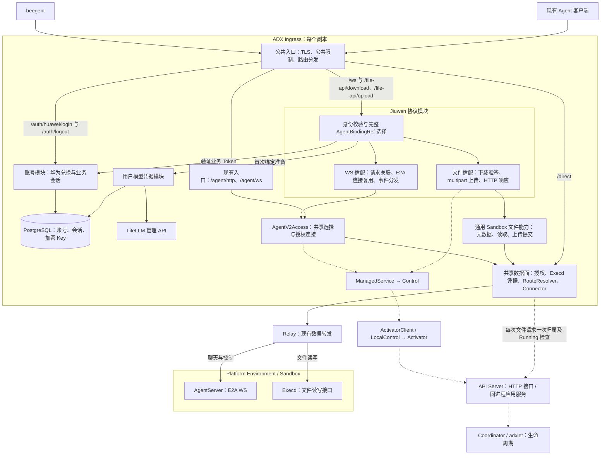
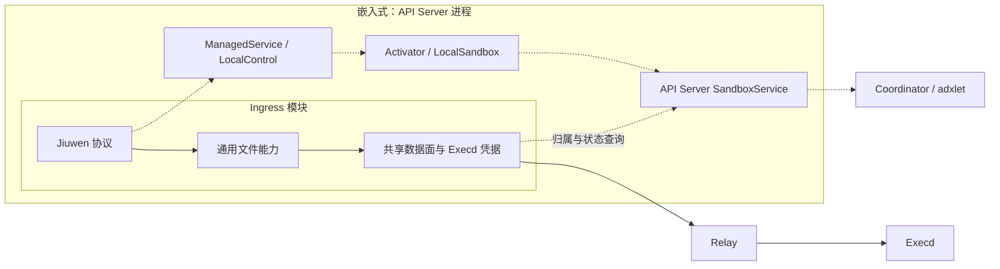
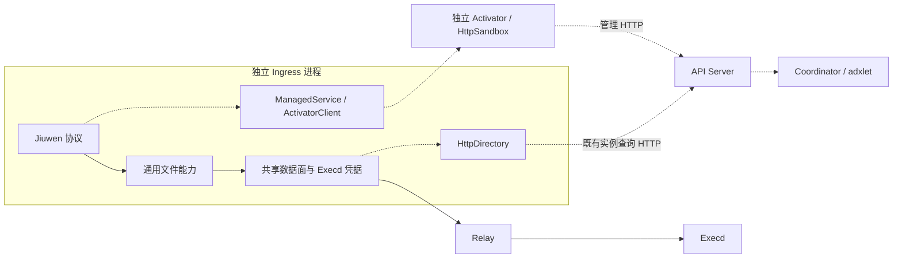

# beegent 接入 ADX Ingress 的 Jiuwen 协议模块设计

状态：已实现 Jiuwen 协议适配、华为登录、共享业务会话、用户级 LiteLLM 凭据和绑定专属启动配置。独立部署已完成真实 Sandbox、跨副本文件传输及经 LiteLLM 的 DeepSeek 对话验证；真实华为授权码登录、鸿蒙实机及生产额度控制仍待验收。固定身份 local_fixed 已移除。账户接入契约和验证边界统一记录在本文。AgentServer 不修改，Platform 仅包含 Execd 启动锁修复。

## 1. 范围

ADX Ingress 新增独立的 Jiuwen 协议模块，对 beegent 暴露 Jiuwen `/ws` 和它需要的附件下载入口。云侧请求不经过 Python Jiuwen Gateway；Python AgentServer 仍运行在 Platform Environment（Sandbox）内，保留 E2A 业务协议。Agent 层的业务映射统一称为 AgentBinding，Environment 专指 Platform 的稳定运行环境。

WS 请求不按 method 名称做 Gateway 白名单过滤；方法名和参数经通用 E2A 通道转发，由 AgentServer 判断是否支持。`session.list`、`session.create`、`session.get_metadata`、`history.get`、`chat.send`、`chat.interrupt`、`chat.user_answer`、`chat.swarmflow_reply` 保留已实现的参数、ACK 和事件兼容映射；其他方法按请求的 `is_stream` 走通用响应映射。客户端实际消费的连接确认、聊天流、运行时确认、历史、交互、工具、子任务、文件等事件和字段仍按对照样例验证。

附件范围包括 `GET /file-api/download?token=...`、`POST /file-api/upload` 和下载链接。上传采用 multipart 表单，使用业务 Bearer 会话选定当前用户的 Sandbox，`token` 查询参数不参与处理；`dir` 和文件名组合出的目标路径限定于模板声明的 Sandbox workspace，文件经 Relay 写入当前用户绑定的 Sandbox；客户端消息内自带 Base64 的附件不需要 Gateway 文件读取。其余 `/file-api/*`、网页、TUI/IM 等入口不在本轮范围；配置、项目、渠道、Cron 和 Git 等 AgentServer E2A 方法可走同一 WS 通用转发，但它们的业务语义仍由 AgentServer 决定。

本轮不修改 AgentServer；Platform／Execd 仅包含用户明确授权的 Execd entrypoint 子进程监控锁作用域修复及回归测试，其余平台改动后置。不新增 Redis 连接互斥或 Relay 按目标限流。所需平台能力尚不满足的部分列为待完善，不通过降低校验标准或绕过能力边界完成验收。

兼容原则：系统尚未上线，只有此前明确确认保留的接口承担兼容要求，不能因为接口或字段已经存在就推导出兼容义务。本方案中已确认保持的 beegent/Jiuwen 对外协议和 AgentServer E2A 契约继续保留；其余重构直接采用目标命名和结构，不为旧版本增加路由别名、字段双读写或存量数据迁移。

## 2. 模块与依赖



图中实线表示入口或数据调用，虚线表示管理依赖；Activator 可独立部署或嵌入部署。Jiuwen 使用业务会话鉴权，AgentV2Access 负责共享目标选择和授权连接。上传、下载通过通用 Sandbox 文件能力，底层与 `/direct` 共用 Execd 授权配置、路由和 Relay；Jiuwen 不取得 Execd token。API Server 只提供管理操作与租户隔离的实例查询，不承载文件正文。verified 的底层读取差异仍见第 5、6 节。

公共入口负责监听、TLS、公共限制和路由分发。Jiuwen 模块负责身份、`/ws` 帧和事件协议、请求与会话关联、E2A 转换及附件 HTTP 语义。它与现有 `AgentApi` 平级，不导入 `agent_api.rs` 的 HTTP handler，也不经公网地址回环调用 `/agent/ws`。当前 Ingress 支持按 `<environment-id>-<port>.<domain>` 的 Host 优先选择直连路由；部署时必须为 Jiuwen 公共入口使用不会命中该规则的 Host，并验证 `/ws` 与附件路径不会被直连路由截获。

Agent v2 内部访问能力是两种入口的共用依赖。保持 `ManagedService → Control → ActivatorClient/LocalControl` 边界，以及 RouteResolver、Connector、Relay 的转发职责。Jiuwen 模块通过 ManagedService 解析 AgentBinding，不直接调用 Platform。公共数据面持有部署注入的 Execd 凭据；Jiuwen 仅提供已验证 tenant、Sandbox ID、文件路径和期限，内部凭据不返回客户端、不写入日志。

## 3. Agent v2 内部接口

`AgentV2Access` 已在 `gateway/src/ingress/agent_service.rs` 实现，由 `AgentApi::service_access()` 提供共享 ManagedService 的访问句柄，供现有 Agent 入口及 Jiuwen 内部连接使用。选择与建连分两步，保留现有 HTTP 连接池：

```text
select(context, Scope { tenant, template, version, binding_id },
       ServiceSelector { protocol, port }) -> ServiceSelection
connect_service(ingress, ServiceSelection) -> IngressStream
```

Scope 中的 tenant 必须来自调用方已验证的身份。`ServiceSelection` 是字段不公开的目标选择结果，携带原始 deadline、绑定 generation 及一次未发送重试预算。选择阶段复用 ManagedService 完成 Template 和服务校验、绑定解析及目标激活；建连阶段复用 Ingress 的路由授权、RouteResolver、Connector 与 Relay。调用方不取得 Activator 凭据、Relay 地址或 Execd token。

现有 `/agent/ws` 已走共享建连方法；`/agent/http` 使用相同的目标选择和 generation 重试实现，同时保留 BackendHttpPool，避免将 HTTP 改成每次新建连接。Jiuwen 的 connection.rs 消费共享选择结果，通过 connect_service_when_ready 取得授权 Relay 流，在流上执行受原始 deadline 限制的 WebSocket 握手；不经公开 HTTP/WS 路由回环。握手完成后接入连接内驱动，路由撤销覆盖握手及整个驱动生命周期。同一 binding 可以建立多条独立连接，并发会话语义由业务处理；入口按已验证业务用户选择目标。连接失败保留 Agent 或 Ingress 的类型化错误，租户不匹配、认证拒绝及 draining 不触发目标重新激活。原始 deadline 覆盖 WS 的目标选择与建连，建立后的业务流不使用该短期 deadline。Jiuwen 对尚未监听的业务端口在同一 deadline 内每 250 ms 重试 TCP 建连；这发生在发送 WebSocket 握手和业务字节之前，不重复查询或激活目标。认证拒绝、draining 和握手失败不进入该等待。
同一次请求的目标失效重试沿用请求 deadline 和绑定 generation；若已开始向后端写入，传输中断、绑定删除或重新创建导致目标变化时直接报错，不自动重放。建立后的业务流由连接本身管理。

文件读写由 `gateway/src/ingress/sandbox_files.rs` 的 `Files` 统一实现：文件元数据、限量读取、上传暂存与提交。Jiuwen `download_runtime::Reader` 保留下载 token 和资产登记验证，上传 handler 保留 multipart、workspace 和用户检查。两者调用通用文件能力；`Sandbox` 生命周期接口不再提供 runtime 凭据读取。`PlatformSandbox` 与 `EnvironmentRequestMapper` 已删除。

通用文件能力在每个上传／下载 HTTP 请求首次访问 Execd 时，经 API Server 校验一次租户归属及 Running。该请求共用一个 Files 上下文，密钥／登记／元数据读取、下载的所有分块、multipart 内全部文件的上传和提交均复用准入结果；失败结果也仅在本请求内保留，新请求重新查询。下载 handler 在完整传输期间保留同一个 Reader。

Files 固定首次准入的运行路由，每次后端操作继续检查本地路由有效性，并保留操作间隙的路由变更事件。目标变化、删除或事件丢失时终止；即使路由恢复也不能续用旧上下文。连接不会自动切换到替代执行实例；错误不自动重放，调用方重新请求时重新准入。业务会话、下载 token、资产登记、期限及在途撤销检查保持。文件请求不经过 Activator 激活，也不创建 Binding 或 Sandbox。

Jiuwen 下载适配负责所需的文件及校验元数据读取，执行现有租户授权检查，处理请求超时、Range、流式响应和错误映射。普通及 verified 下载均基于现有 Execd 实现；后者保留 token 与资产登记校验，底层文件打开和并发读取语义沿用 Execd，不宣称与原 AgentServer 读取实现完全等价。

创建侧复用 `EnvironmentSpec.runtime_profile`：Platform 已支持部署侧 rootfs、bootstrap 和环境配置。独立 Activator 通过 API Server 既有 HTTP 接口创建，嵌入式 Activator 使用 API Server Sandbox 应用服务；runtime 注入归 API Server 部署配置。Agent 模板不再提供 entrypoint/working_dir，创建时启用 `inherit_entrypoint`，由 Platform 提取业务镜像的 ENTRYPOINT/CMD/WORKDIR/USER，生成进程配置供 Execd 执行。业务镜像无需预置 Execd 或额外 JSON。模板工作目录覆盖、持久挂载及目录管理本轮不实施。Inline HTTP 兼容入口已移除。节点 profile 匹配及 Execd 实际端口/token 需通过真实创建验证。此项属于创建适配，与文件数据面访问分离。

### 通用沙箱文件访问与管理查询

创建侧继续由 Activator 把 CreateSandbox/ExecutionSpec 转成 Sandbox 请求，API Server 的 prepare_create/create_request 负责自己的请求校验及 runtime 注入。API Server 不接收 AgentBinding 或 ExecutionSpec。

文件侧无需新增返回 Execd token 的接口。独立 Ingress 的 `HttpDirectory` 调用既有 `GET /api/instances?instance_id=...`，使用对应 tenant 的管理 API Key，要求返回恰好一个元素的数组，并检查该元素的 ID 和 Running；嵌入式注入 API Server `SandboxService` 实现的 `SandboxDirectory`，复用 inspect 及租户校验。查不到、越权或未运行均拒绝。查询只用于访问准入，不提供文件流或凭据。

`ADX_SANDBOX_FILES_CONFIG` 指向数据面的文件访问配置。公共 `ExecdAccess` 从其中的 `token_env` 环境变量引用加载凭据，`port` 必须等于 Ingress 的 default_direct_port。独立配置同时声明 API Server URL、CA 与租户管理 Key 的环境变量名；嵌入式使用注入的目录服务，不配置 HTTP 目录或管理 Key。示例见 [独立配置](../../gateway/examples/sandbox-files.json) 和 [嵌入式配置](../../gateway/examples/sandbox-files-embedded.json)。Jiuwen 配置不包含 Execd token；业务下载签名密钥仍遵循模板或 Sandbox 文件的原协议。

部署必须将同一 Execd 端口及 Secret 注入 API Server runtime profile、节点和公共数据面。节点 env 可覆盖 runtime_profile.env，当前实例查询无法证明节点最终配置；实现不自动校验跨进程配置一致性。不同节点独立凭据及单侧轮换不在当前模式支持范围内。不能从用户 env 猜测凭据，也不保留旧 spec.env 查询回退。更换配置后必须通过真实新建 Sandbox 的上传下载验证。

两种部署只改变管理调用的传输方式，文件正文均经过 Ingress → Relay → Execd：





本地组件验证覆盖两种目录实现、租户隔离、新创建规格不含旧 env 凭据、公共 direct 与 Jiuwen 上传下载。2026-10-10 的独立部署验证覆盖真实新建 Sandbox、跨副本上传下载和真实模型调用；嵌入式创建另有此前真实容器验证及 2 MiB 工作线程栈回归。合入最新上游后的版本通过本地回归，未再次部署云端。

## 4. AgentBinding 与唯一的 Environment 语义

ADX 当前入口认证获得的是租户身份，不等于终端用户 `user_id`。Jiuwen 模块应在 WS 与附件 HTTP 请求上取得相同的已验证 `user_id`，由服务端将 `(tenant, user_id, 固定 Agent 类型)` 映射到稳定的业务 binding_id，再结合模板及版本选择 AgentBinding。客户端不能指定其他用户的绑定或 Environment，也不能持有 ADX 租户 API Key。

Agent 层业务对象已统一称为 `AgentBinding`，完整业务身份为 `(tenant, template, version, binding_id)`，保存目标 `sandbox_id`、绑定 generation 和删除意图。`sandbox_id` 就是 Platform Environment ID；只有 Platform Environment 拥有运行状态、调度、暂停恢复和 Runtime 替换语义。AgentBinding 是业务地址到该环境的映射，允许先提交绑定身份再发起平台创建，并不是另一套运行环境或平台状态机。

代码中的 `Scope.binding_id` 是业务绑定 ID，不是 Platform Environment ID。Agent 的类型、方法、API 路径、target URN、请求响应及持久化字段已统一到 AgentBinding 命名：业务字段使用 `binding_id`，管理路径改为 `/api/agent/v2/templates/{name}/versions/{version}/bindings/{binding_id}`（列表路径省略最后一段），目标 URN 使用 `urn:adx:binding:{name}:{version}:{binding_id}`。同步修改调用方、测试、文档及开发约定；不保留旧名称的兼容别名、序列化映射或存量数据迁移。此命名变更已实现并通过聚焦测试；Platform 的 Environment 类型保持不变。

同一业务 binding_id 在不同模板版本下形成不同 AgentBinding，分别绑定不同 Platform Environment。绑定删除后重建仍使用新的 generation 和 Sandbox ID，保留多副本创建幂等、未知结果沿用原身份、旧请求不能影响新绑定的约束。Jiuwen 模块预置模板版本，临时代行 App 的版本选择；修改预置版本属于业务版本切换，不是平台自动升级。后续由 App 选择并由服务端校验版本，数据迁移、兼容性和回滚由业务负责。本轮保留现有身份与生命周期行为，不实现同一个 Environment 跨版本升级。

### 业务账号与用户模型配置

Ingress 新增账号模块：华为 Account Kit 授权码兑换可信 UnionID，关联内部 userId，签发默认 7 天的不透明业务 Token。用户与会话存储在共享 PostgreSQL，支持多个 Ingress。Jiuwen 的 `/ws` 和下载入口只从业务会话取得身份；ADX 管理及内部服务保持独立鉴权。

`ADX_JIUWEN_CONFIG` 配置 tenant、agent_type、template、version、allowed_hosts、allowed_origins 和传输限制，配套 `ADX_ACCOUNT_CONFIG` 配置账号存储与 LiteLLM。不再配置固定 user_id 或 local_fixed。Jiuwen 不检查传输层 TLS 状态；HTTP 与 HTTPS 监听共享相同业务鉴权，不存在鉴权失败回退。公网 HTTPS/WSS 可在 ELB 终止，内部通过 HTTP/WS 回源。原有 Ingress TLS 与内部 mTLS 能力保留，网络开放范围由部署层控制。客户端须在 WS 握手及附件请求中携带业务 Token。

binding_id 为紧凑 JSON 数组 `[tenant,userId,agent_type]` 的 SHA-256 小写十六进制加 `jiuwen-` 前缀。模板版本只进入完整 Scope。请求的身份字段不能改选目标；`/ws` 忽略客户端查询参数 `user_id` 的值，所有身份与实例路由仍取自业务会话。下载中的 user_id 仅做一致性核对。

登录不创建实例或调用 LiteLLM。首次 WS 为用户注册/复用 LiteLLM 模型 Key，并通过内部 `bindings/prepare` 原子提交绑定与加密私有启动配置。Activator 将私有模型环境变量覆盖到模板配置后创建 Sandbox；重试、跨副本创建和重建复用该 Binding 的同一份配置。公开 Binding/Template 不返回用户 Key。用户可在自己的 Sandbox 中读取自己的 Key。

详细接口、数据库 schema、凭据签发重试、加密与密钥部署、会话撤销和验证范围见本文第 8 节。退出不销毁绑定或更换模型 Key。密钥热轮换、账号禁用到 LiteLLM 的自动联动后置。

## 5. Jiuwen 协议和附件

`/ws` 接收 `{type:"req", id, method, params}`。模块验证 beegent 方法与参数，向 AgentServer 发送 E2A envelope，并维护客户端请求 ID、E2A 请求 ID、用户、会话和连接的对应关系。必须区分请求 ACK、`runtime.accepted`、业务最终事件和 `chat.interrupt_result`；服务端主动推送仅发给有权接收的连接。历史分页、事件顺序、断线后的结果未知状态以 beegent 与当前 Jiuwen Gateway 的对照样例为准。

源码核对还确认：`session.get_metadata.is_processing` 在原 Gateway 中由本地 busy 状态补充，并非 AgentServer 元数据提供的权威运行快照。模块须跟踪本副本收到的处理状态与中断事件；跨副本重连后的准确状态恢复未获现有协议保证。AgentServer 在所拥有的 E2A 连接断开时会尝试取消在途工作（部分后台任务除外），不能承诺断连续流。客户端按结果待确认处理，禁止自动重放。客户端兼容行为由协议、会话及响应映射回归测试覆盖。

连接行为：一个前端 WS 复用到目标 AgentServer 的一条 E2A 连接，不按方法、会话或业务消息重新建连。多个前端可以同时连接同一个 binding，包括其他前端仍在握手或已运行时；每个前端拥有独立的 E2A 流和驱动状态。网关不再按 binding 占用连接或返回 `409 ALREADY_CONNECTED`，也不抢占旧连接。并发请求、会话冲突及业务侧连接策略由 AgentServer／业务自行处理。关闭一条连接只释放其自身资源；租户鉴权、路由撤销、期限和传输层资源保护继续生效。

后端握手沿用 Sandbox 内 AgentServer 的根路径，Host 为 `127.0.0.1:<service-port>`、Origin 为 `http://127.0.0.1:<service-port>`；地址仅用于已授权流上的 HTTP 握手，不用于额外拨号。启用 AgentServer Origin 检查的镜像需将该后端 Origin 主机加入允许列表；不得透传客户端凭据。本地验收镜像及后端握手已验证；正式部署仍需配置相应 Origin 允许规则。

附件保持 `GET /file-api/download?token=...` 对外协议，内部改为 `Jiuwen 下载适配 → 通用 Sandbox 文件能力 → 共享数据面与 Relay → Execd`。上传增加 `POST /file-api/upload`，先用当前业务会话选定 AgentBinding，再校验 multipart 表单中的用户、相对目录和文件名；有界读取整个表单后经同一 Relay 路径写入 Sandbox workspace。上传查询参数 `token` 被忽略，本阶段没有上传文件令牌的签发和验签。通过 AgentBinding 确定目标 Platform Environment，任意 Ingress 副本独立处理下载，不查找聊天所在副本，不为下载新建或复用 AgentServer E2A 连接。到 Execd 的额外流与到 AgentServer 的 WS 是不同目标，不涉及 AgentServer push 连接抢占。

Jiuwen 下载适配负责用户和环境绑定、token 签名及有效期规则、verified 资产登记校验、文件名与 Content-Type、Range 和错误映射。普通 token 和 verified token 分别实现其签名及声明校验，不混用授权语义。verified 校验不仅是 HMAC 验签，还依赖环境内资产登记状态、路径、大小和摘要字段；底层读取差异按下一段处理。下载配置以所选 Jiuwen AgentServer 模板版本的 env 为唯一来源，模板负责向 AgentServer 注入，Ingress 的 Jiuwen 模块读取同一配置；具体规则见下文。不能将未验签路径直接交给 Execd。beegent 当前将 WS 和下载设为不同端口，云端地址与 TLS 配置也需要同步调整。

Jiuwen 模块和 Jiuwen AgentServer 模板由同一业务部署管理，共用配置，无需在 Ingress 再维护一份密钥或路径配置。现有 `TemplateVersion.env → ExecutionSpec.env` 已支持向 Sandbox 传递这些变量；Jiuwen 模块通过共享 ManagedService 获取所选租户、模板、版本的同一不可变 TemplateVersion，继续遵守 Activator 访问边界。`download_config.rs` 已实现从模板解析下载配置，以及通过 ManagedService 按作用域读取同一模板；这一步不创建 AgentBinding 或 Sandbox。`download_token.rs` 已实现密钥内容解析、原始 token 验签、声明与资产登记检查；`download_runtime.rs` 保留 Jiuwen 下载的验签和资产登记逻辑，通用 `sandbox_files.rs` 执行管理准入、数据面授权、Relay 建连与 Execd HTTP 读写。正文限制、原始 deadline、路由撤销及取消释放保持不变；此分层不增强 Execd 原有文件打开的一致性保证。

| 模板 env 配置 | AgentServer 与 Jiuwen 模块的共同用法 |
| --- | --- |
| `JIUWENSWARM_WORKSPACE` | 模板显式设置 Sandbox 内绝对路径；未配置有效的显式签名密钥时，AgentServer 在该目录下 `config/.file_download_secret` 读取或生成密钥，Jiuwen 模块通过 Execd 只读获取当前 Sandbox 的同一文件 |
| `JIUWENSWARM_FILE_DOWNLOAD_SECRET` | 可选；配置有效值时，两端直接使用同一值，不要求额外落盘，也不读取自动生成的密钥文件 |
| `JIUWENSWARM_DOWNLOAD_ASSET_ROOT` | 模板显式设置 Sandbox 内绝对路径；AgentServer 写入交付文件及 `<asset_id>.json`，Jiuwen 模块在需要资产登记校验时通过 Execd 读取同一目录 |

共享配置不改变 Sandbox 文件隔离：采用文件密钥时，不同 Sandbox 在同一路径拥有各自的密钥文件；Ingress 按当前已授权目标读取。模板显式填写路径，避免依赖镜像 HOME、UID 或临时目录推导。Jiuwen 模块不执行运行时环境探测、不扫描 AgentServer 进程、不自行创建或替换密钥；镜像启动逻辑应遵守模板注入配置。配置解析已拒绝缺少路径、相对路径、父目录跳转及非空但少于 32 个字符的显式密钥；空或缺省密钥选择文件模式。显式密钥保留原始值，资产目录按 AgentServer 规则去除首尾空白，路径仅做词法规范化，不在 Ingress 宿主机解析。Debug 隐去密钥值。后续文件读取若失败，下载返回错误，不另生成密钥。密钥只用于内部校验，不进入公开响应、业务事件或日志。模板版本选择同时决定 AgentServer 与下载模块使用的配置，切换版本遵循既定业务升级语义。

下载校验实现分为两步：`DownloadVerifier::verify` 先对原始 Base64URL 文本进行 HMAC-SHA256 校验，再解析路径、会话、有效期及 verified 声明；返回的 SignedDownload 尚不代表资产已获准读取。`check_file` 再次检查有效期，要求普通文件；verified 还校验模板资产目录边界、登记 ID、staged/committed 状态、路径、到期时间、大小、摘要及实际文件大小，成功后返回 CheckedDownload。普通与 verified 共用后续文件读取链路；摘要与登记值比较，不重新计算整个下载内容的散列。

普通无 exp token 仅接受原签发器允许的 path/sid 或 path/sid/download_http_base 两种完整 schema；带 exp 的普通 token 按原校验函数的整数秒边界判断，verified 同时采用资产登记的精确到期时间。download_http_base 只作为已签名的兼容字段接受，不参与目标路由。其他 purpose/kind 不作为普通文件 token 接受。可选会话约束由可信请求上下文提供，文件 token 本身不证明用户身份。

token 输入上限为 16 KiB，密钥及登记内容各为 64 KiB。显式密钥保留原值，密钥文件内容按 AgentServer 规则 trim 后使用；缺失、非 UTF-8 或过短的文件密钥均失败，不生成替代密钥。内部下载准入已通过 Execd HTTP 契约读取密钥、登记及元数据，并在读取结束后重新检查有效期；读取全程共用请求 deadline，监听路由撤销，调用取消时释放 HTTP 连接和会话，不遗留后台连接任务。读取上限按实际响应体执行，不依赖 Content-Length。此前已有真实 Sandbox 下载验收；本轮另外验证业务会话准入和撤销；内部 HTTP 适配已实现分块读取、逐块重新准入、有效期／撤销检查、Range 和错误映射；公开用户认证与目标 binding 装配已实现，生产联调待验收。

内部 HTTP 响应保持原两分支行为：verified 支持单段 Range、206/416、Accept-Ranges 及 inline；普通附件忽略 Range/inline 并返回完整 200 附件。两者支持 HEAD、空文件、Content-Length、no-store、UTF-8 文件名与按扩展名推断 MIME（未知类型使用 application/octet-stream）。对 Execd 以不超过 64 KiB 的区间请求按需读取，核对 206、Content-Range、总大小及实际正文长度；后端忽略 Range、返回错误区间、短读或超长正文均为上游错误。首次正文读取成功后才返回成功响应头，已缓冲首块在消费前再次准入，后续每块也重新验证密钥、token、登记与元数据，并在读取完成后重查到期时间。消费端背压不会触发后台预取，取消会丢弃当前读取 future；传输沿用调用方的整个请求 deadline。响应头已发送后的错误中止正文，不静默返回截断成功文件；不保证文件内容快照或同描述符读取。

本轮以已验证用户对其 Sandbox 的访问权限为主要安全边界，附件 HTTP 请求仍必须校验用户归属；下载继续校验文件 token，上传使用 multipart 表单且不校验上传 token。不新增仅凭链接匿名分享的访问方式。现有 Execd 的 fs_get_info 使用路径元数据并单列最终符号链接，适配层拒绝该类型；/download 自身仍跟随符号链接，路径元数据检查与文件打开分离；原 verified 的 `O_NOFOLLOW`、打开后 `fstat` 及同一描述符检查/读取语义不在本轮补齐。此差异作为已确认的实现限制，不单独阻塞普通或 verified 下载实施及本轮功能验收，不回退 E2A。目录或文件并发替换时不保证登记对象与实际读取对象一致，也不保证内容快照；需要复现原读取约束或引入单文件分享权限时再评估增强。验收必须通过用户隔离、签名、有效期和资产登记等已承诺校验，并明确记录上述限制，不宣称完整复现原 verified 安全语义。

## 6. 待完善能力与本轮边界

| 能力 | 当前处理 |
| --- | --- |
| 业务启动与就绪检查、路由可达保证 | Platform 仍可能在 AgentServer 就绪前返回 Running；不在 Jiuwen 模块补健康检查。沿用原环境身份重试和结果未知语义，映射现有 warming、失败及超时事件 |
| 部署侧 runtime profile 与启动配置 | Platform 已有能力；本轮接通 Agent/Gateway 创建映射，覆盖独立及嵌入式 Activator，验证业务镜像和进程配置；仅额外包含用户授权的 Execd 启动锁修复，超出现有契约的能力另列待完善 |
| 挂载、数据持久化与恢复 | 明确历史、文件、资产登记和密钥的位置及实际保留范围；稳定 ID 不代表 Sandbox 重建后数据可恢复，不承诺尚未验证的恢复能力 |
| verified 底层读取增强 | 本轮不改 Execd 文件读取；保留用户归属、token 与资产登记校验，接受并明确记录符号链接及检查/打开竞争差异，不以此单独阻塞下载功能验收 |
| 同一 Sandbox／binding 的业务连接并发 | 由业务自行处理，Jiuwen 不设置单连接限制，不新增 Platform 按目标连接上限；现有传输资源保护保留 |
| 创建取消、期限传递与删除确认 | 沿用当前 Platform 契约，超时不能被解释为未执行，不用新 ID 重建掩盖结果未知 |

其中 runtime profile 的 Agent/Gateway 创建适配属于本轮实现任务；列为待完善的平台能力不在本轮修改。参照 [已知依赖与缺口](../../agent/PLATFORM_GAPS.md)逐项核对当前源码，实施时同步纠正将已有 runtime profile 能力归为平台缺失的旧描述；若必需用例依赖尚缺能力，应记录未完成验收及依赖，不能通过 Gateway 临时脚本绕过。

## 7. 验证限制

此前 Python Gateway→ADX 的本地端到端结果不证明新模块可用。尚无分段性能数据证明 Python Gateway 是主要延迟来源；环境冷启动、AgentServer 和模型耗时需分项测量。验收分别记录模拟客户端、真实 ADX Environment 和 beegent 实机的结果，不混写为同一种证据。

## 当前验证证据

此前真实容器验收已通过独立/嵌入式 Activator 创建、镜像 ENTRYPOINT/CMD/WORKDIR/USER 继承、Execd 控制响应、WS 协议、跨副本普通/verified 下载和模拟模型最终回复。API Server 栈溢出与默认规格冲突已经修复。

2026-10-10 的独立部署完成 13 项内部检查和 6 项公网检查，覆盖测试会话认证、冷启动与热连接、跨副本上传下载、Range/HEAD、签名和跨用户隔离，以及通过 LiteLLM 的真实 DeepSeek 对话。冷启动样本使用已缓存镜像，不代表所有冷启动场景或容量压测已通过。合入最新上游后，Gateway 191 项、API Server 71 项测试及工作区 Rust 检查通过；该合并版本未重新部署云端。端到端脚本和运行产物不随本方案提交。真实华为授权码登录、鸿蒙实机、生产额度拦截、文件检查与打开竞态、持久挂载和平台业务就绪契约仍未完成验证或实现。

## 8. 账户接入与部署契约

### 两层安全边界

Jiuwen 的 `/auth/huawei/login`、`/auth/logout`、`/ws`、`/file-api/download`、`/file-api/upload` 使用业务账号体系。客户端通过华为 Account Kit 取得授权码，Ingress 兑换身份并签发不透明业务 Token。WS、上传和下载只从已验证会话取得 userId；tenant、Agent 类型、模板与版本来自服务端配置。

ADX 管理 API、内部 Activator、Platform 和 Relay 继续使用原有租户／服务认证，业务 Token 不授予这些管理权限。多个业务用户可以属于同一 ADX tenant；Jiuwen 按 `(tenant,userId,agent_type)` 派生 binding_id，并结合 template/version 选择完整作用域。客户端不能通过查询参数或消息中的用户字段改选其他 Sandbox。

已移除 `local_fixed` 配置与入口回退。测试身份只通过测试中的 BusinessAuth / IdentityProvider 实现注入，不提供生产模拟身份开关。Jiuwen 模块不感知监听器的 TLS 状态，也不依据 X-Forwarded-Proto 授权。HTTP 与 HTTPS 监听使用相同业务认证。公网 TLS 由部署入口负责，可由 ELB 终止后使用 HTTP 回源，或使用 Ingress 原有 TLS 监听器；HTTP 回源端口仅在受控内部网络开放。

### 接口

| 接口 | 请求 | 结果 |
| --- | --- | --- |
| POST /auth/huawei/login | application/json；authorizationCode；首次注册需 agreementVersion | userId、token、tokenType=Bearer、expiresIn；Cache-Control: no-store |
| POST /auth/logout | Authorization: Bearer 业务 Token | 幂等撤销当前会话，204；不删除 Binding 或模型 Key |
| GET /ws | Authorization: Bearer 业务 Token；标准 WS Upgrade；可省略 user_id，传入则忽略其值 | 认证后选择用户 Binding；允许多条独立连接，并发策略由业务负责 |
| POST /file-api/upload | Authorization: Bearer 业务 Token；multipart/form-data | 写入用户已有 Binding 的 workspace；请求体最多 64 MiB、最多 20 个文件；不创建实例 |
| GET/HEAD /file-api/download | Authorization: Bearer 业务 Token；原下载 token 查询参数 | 独立验证用户和下载 token，读取用户已有 Binding；不存在返回 404，不通过下载创建新实例 |

`/ws` 的 URL 查询参数 `user_id` 不参与身份验证、Binding 选择或后端用户身份构造；传入不同、空或重复的值均忽略。身份始终取自业务 Token 对应的会话。其他查询参数及超过 1024 字节的查询串返回 `400 INVALID_QUERY`；未携带有效 Token 仍返回 401。下载入口的独立 token 与 user_id 一致性校验保持原契约。

登录示例：

```json
{"authorizationCode":"<Account Kit code>","agreementVersion":"1"}
```

```json
{"userId":"<internal UUID>","token":"<opaque business token>","tokenType":"Bearer","expiresIn":604800}
```

请求不接受 clientId、clientSecret、userId、tenant 或 apiKey 等客户端身份覆盖字段。Code 原样经表单编码兑换，不自动重试已发送的兑换；超时或结果不明时客户端重新获取 Code。首次注册缺少正确协议版本返回 403 / AGREEMENT_REQUIRED。无效或过期会话返回 401，账号不可用或身份与资源不匹配返回 403，依赖不可用返回 503；503 不要求客户端清除仍可用的 Token。

业务 Token 为 32 字节密码学随机值的 Base64URL 编码，数据库仅保存 SHA-256 摘要。默认绝对期限 7 天，可配置 60..604800 秒，不滑动续期。不保存或下发华为 Access Token、Refresh Token。华为 ID Token 使用官方 OIDC discovery/JWKS，验证 RS256/PS256 签名、kid、iss、aud、exp、nbf 和非空 sub；JWKS 有界缓存，端侧仍须自行严格核对登录 state。

WS 在握手、每个业务消息前检查会话，并在空闲时周期复查；会话绝对到期触发关闭。下载流也监控会话到期和撤销。后台复查间隔 30 秒，另有最多 10 秒鉴权超时；不承诺退出瞬间跨副本切断所有连接。鉴权失败／存储不可用时关闭流，不匿名放行，不重放业务请求。

### 数据与模型凭据

PostgreSQL 独立 schema `adx_accounts` 保存：

- users：tenant、内部 user_id、provider、developer_scope、client_id、大小写敏感 union_id、status、注册协议版本与时间；华为身份唯一约束防止并发重复创建用户。
- sessions：Token 摘要、tenant/user_id、绝对到期时间、撤销时间。
- model_credentials：每个 tenant/user_id 一份随机模型 Key 的加密值、凭据版本、签发完成状态。

内部 userId 不等于华为 UnionID。LiteLLM user_id 是 tenant/userId 的稳定、无歧义散列标识；API Key 是独立随机 `sk-...` 值。每个业务用户复用一个有效模型 Key，多个 Binding 和登录会话共用该用户额度。

登录不依赖 LiteLLM，也不创建 Sandbox。首次 WS 需要新 Binding 时，先在 PostgreSQL 原子保存候选 Key，再调用 LiteLLM `/user/info`、`/user/new`、`/key/info`、`/key/generate`。每次重试使用同一已保存 Key；未知结果通过 key/info 对账，不换 Key。管理 API 使用受保护的管理凭据，密钥查询使用 Key 的 SHA-256，不将可用 Key 放在查询 URL。用户 Key 指定 user_id、llm_api 类型、模型白名单、预算周期和 RPM/TPM；生产需选用支持这些 API 参数的 LiteLLM 版本并真实验收。

Jiuwen 经 `ManagedService.prepare_binding` 调用内部 `/internal/adx/v1/bindings/prepare`，私有 LaunchConfig 仅允许 API_KEY、API_BASE、MODEL_NAME、MODEL_PROVIDER。AgentState 将加密配置与新 Binding 在同一个 Redis 事务内提交，AAD 绑定完整 Scope 与 generation。配置不出现在公开 Binding/Target/列表中；Debug 隐去明文。重复准备相同配置返回同一 Binding，不同配置返回冲突。绑定删除确认后同时删除私有配置。

Activator 将私有配置覆盖到模板环境变量，再调用已有 Sandbox 能力。独立及嵌入式模式共用这一实现。配置在 Binding 生命周期内不可变；冷启动重试和重建复用它，热实例访问不查询 LiteLLM 管理服务。当前不实现密钥热轮换；需要显式处理相关 Binding 和 Sandbox。用户可以在自己的 Sandbox 中取得自己的模型 Key；管理密钥和上游共享密钥不注入。

退出仅撤销当前业务会话。将账号设为 disabled/deleted 会拒绝登录和业务访问，但不会自动调用 LiteLLM 撤销已发 Key；若需要同时停止独立模型调用，运维需在 LiteLLM 阻断该 Key。自动账号状态联动不在本期实现中。

### 部署

配置示例：[Jiuwen](../../gateway/examples/jiuwen.json)、[账号](../../gateway/examples/accounts.json)。

部署前由数据库 schema 所有者执行 [schema.sql](../../gateway/src/ingress/accounts/schema.sql)。Ingress 数据库角色仅需 schema USAGE、表 SELECT/INSERT/UPDATE，不需创建 schema 权限。PostgreSQL 可与 LiteLLM 共用实例，使用独立 schema 和角色；ADX 不读写 LiteLLM 内部表。

Ingress 环境配置：

```text
ADX_JIUWEN_CONFIG=/etc/adx/jiuwen.json
ADX_ACCOUNT_CONFIG=/etc/adx/accounts.json
ADX_AGENT_CONFIG=/etc/adx/agent.json
ADX_SANDBOX_FILES_CONFIG=/etc/adx/sandbox-files.json
HUAWEI_OAUTH_CLIENT_ID=<应用 Client ID>
HUAWEI_OAUTH_CLIENT_SECRET=<应用 Client Secret>
ADX_ACCOUNT_DATABASE_URL=<PostgreSQL URL>
ADX_LITELLM_ADMIN_KEY=<LiteLLM 管理凭据>
ADX_CREDENTIAL_KEY_FILE=/run/secrets/adx-credential-key
```

credential-key 文件包含 32 字节随机密钥的 64 位十六进制文本，保护文件读取权限，并备份密钥。所有 Ingress 和独立 Activator 必须挂载相同密钥；独立 Activator 也配置 ADX_CREDENTIAL_KEY_FILE。未配置时，通用 Agent 功能可继续使用，但私有绑定配置准备与读取失败。不要随进程重启重新生成，否则已有凭据无法解密。

PostgreSQL 默认强制 TLS 并验证证书，database_ca_file 可增加内部 CA；database_allow_plaintext 仅用于明确受信的隔离网络。LiteLLM 默认要求 HTTPS，allow_plaintext 仅用于同类内部网络。华为目标地址固定，不接受请求覆盖。生产凭据缺失或数据库 schema 不匹配时启动失败，不回退到本地身份。

allowed_hosts 校验 Jiuwen Host；浏览器 Origin 必须精确匹配 allowed_origins（包含 HTTP/HTTPS scheme 和非默认端口）；原生客户端无 Origin 可使用。Jiuwen 域名不能与 Sandbox 端口直连域名冲突。既有 Ingress 客户端 ACL 仍生效。公网负载均衡仅发布 Jiuwen 所需路径，内部管理与基础组件保持网络隔离。

会话表需运维定期清理过期记录。日志不记录授权码、业务 Token、模型 Key、下载链接或管理密钥。数据库备份包含密文，仍按敏感账号数据保护。

### 客户端接入与验证范围

鸿蒙客户端需完成 Account Kit 主动登录、state 校验、业务 Token 安全保存及退出处理；WS 握手与所有上传下载路径都携带 Authorization。Token 不进入 URL。在线退出后关闭 WS、取消下载并清理当前用户缓存；迟到登录结果不能恢复已退出会话。客户端修改与真机验证单列，ADX 后端验证不替代它们。

本地验证使用真实 PostgreSQL、模拟 Huawei 身份提供方和 LiteLLM HTTP 服务，并独立测试华为签名/声明校验。云端另已验证经 LiteLLM 的真实 DeepSeek 对话；真实华为 Code 兑换、生产 LiteLLM 用量拦截及手机 UI 仍需联调，不宣称已通过。

参考：[华为凭证接口](https://developer.huawei.com/consumer/cn/doc/doccenter-references/api/account-api-obtain-user-token)、[LiteLLM 虚拟密钥](https://docs.litellm.ai/docs/proxy/virtual_keys)。
